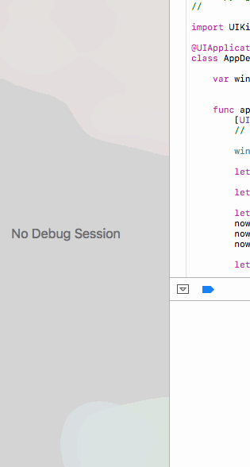
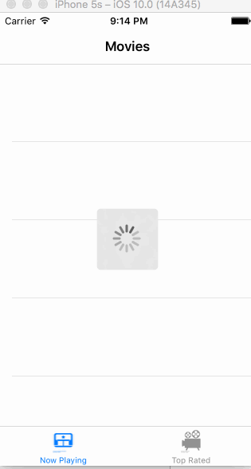

# Flicks

This is a viewer for currently playing and top rated movies.

Time spent: 4 hours spent in total

Completed user stories:

 * [x] Required: User can view a list of movies currently playing in theaters from The Movie Database. Poster images must be loaded asynchronously.
 * [x] Required: User can view movie details by tapping on a cell.
 * [x] Required: User sees loading state while waiting for movies API. 
 * [x] Required: User sees an error message when there's a networking error. 
 * [x] Required: User can pull to refresh the movie list.
 * [x] Optional: Add a tab bar for Now Playing or Top Rated movies. 
 * [] Optional: Implement a UISegmentedControl to switch between a list view and a grid view.
 * [] Optional: Add a search bar.
 * [] Optional: All images fade in as they are loading. 
 * [] Optional: For the large poster, load the low-res image first and switch to high-res when complete.
 * [] Optional: Customize the highlight and selection effect of the cell.
 * [] Optional: Customize the navigation bar. 
 
Notes:

I was trying to add the low res images and fading in. As I was testing I accidentally added a breakpoint without noticing and ended up reverting my changes thinking it was broken. 

Getting the network error took about a minute

Walkthrough of all user stories:

GIF created with [LiceCap](http://www.cockos.com/licecap/).
Icons by Smar-rtez and Alejandro Santander from Noun Project

